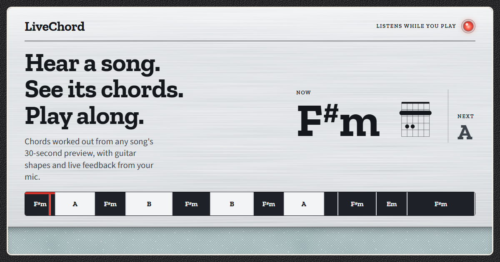

# LiveChord 🎸

**Hear a song. See its chords. Play along.**

Search any song and LiveChord maps its chord progression onto a timeline with
guitar diagrams, then listens through your microphone and tells you, in real
time, whether you are playing the right chord.

**▶ [Try it live](https://sunny2802-live-chord-ai.hf.space)**, no install, works in any modern browser.



## Features

- **Search any song**: the iTunes Search API provides a 30-second preview of almost any track, with no API key.
- **Chord timeline**: the progression is laid out on a clickable timeline (major chords light, minor chords dark) with *Now* / *Next* readouts while it plays.
- **Guitar diagrams** for every detected chord, with its notes and how much of the song it covers.
- **Practice with your mic**: follow the song, or drill a single chord. LiveChord scores how often you land on the target and your best streak.
- **One-click examples** that are pre-analysed at boot, so a first-time visitor gets results instantly.

## How it works

```
iTunes preview (30 s AAC)
   └─ ffmpeg decode → mono 11 kHz
        └─ Constant-Q transform (7 octaves, 36 bins/octave, tuning-corrected)
             ├─ onset envelope → beat tracking (for snapping chord changes)
             └─ HPSS (median filtering) → harmonic CQT → 12-bin chroma
                  └─ 1 s windows · cosine match vs 24 major/minor templates
                       └─ softmax emissions → Viterbi decoding (sticky transitions)
                            └─ beat-snapped segments, short blips removed
```

- **One CQT, reused.** Beat tracking, harmonic separation and chroma all come
  from a single constant-Q transform, which is roughly 15x faster than
  separating the waveform and transforming it again.
- **Viterbi smoothing** replaces per-window argmax with the most likely chord
  *path*, so a passing note does not flip the chord.
- **Live practice.** The browser streams raw microphone PCM over a WebSocket
  (voice-processing filters off, resampled to 22.05 kHz when the device runs at
  48 kHz). The server classifies the last second four times a second, off the
  event loop, against the same 24 templates as the timeline.

A transformer model (`transformer_model.py`, trained with `run_training.py`) is
included for experimentation. Serving uses the template + Viterbi decoder,
which recognised the known chords of the test songs more reliably.

## Tech stack

Python · FastAPI · WebSockets · librosa · NumPy · ffmpeg · vanilla JS + Web Audio API · Docker

## Run locally

```bash
pip install -r requirements.txt      # ffmpeg comes from imageio-ffmpeg if not installed
python app.py                        # http://localhost:8080
```

The microphone needs `localhost` or HTTPS. Wear headphones while practising,
so the mic hears your instrument rather than the song.

## Configuration

| Variable | Default | Purpose |
|---|---|---|
| `SEARCH_BACKEND` | `itunes` | `itunes` (30 s previews, no key), `youtube` (full songs, needs YouTube reachable) or `jamendo` (Creative Commons) |
| `JAMENDO_CLIENT_ID` | unset | Required for the Jamendo backend |
| `MAX_CONCURRENT_ANALYSES` | `1` | Analyses run one at a time to fit a 512 MB host |
| `AUDIO_TTL_SEC` | `3600` | How long analysed audio (and its cached result) is kept |
| `PREWARM_EXAMPLES` | `1` | Pre-analyse the example songs at boot |
| `ALLOW_ANY_AUDIO_URL` | `0` | Let `/api/from-url` fetch hosts other than the search backends' |

## Deploy

- **Hugging Face Spaces**: this README's front-matter configures a Docker Space on port 7860.
- **Render**: `render.yaml` is a ready blueprint for the free tier.

## Project structure

```
app.py                 FastAPI server: search, analysis, caching, WebSocket
static/                index.html, styles.css, script.js (no build step)
transformer_model.py   experimental transformer chord model
run_training.py        synthetic training pipeline for the transformer
Dockerfile             container for HF Spaces / Render
```

---

Built by [Pranav](https://www.linkedin.com/in/pranav2ranjit). Audio previews courtesy of Apple.
